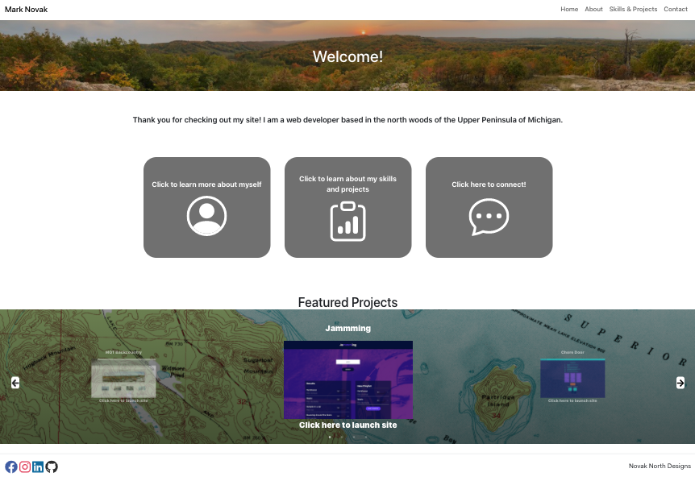

# Mark Novak
> This is my personal portfolio website to showcase my work and skills.

## Table of contents
* [General info](#general-info)
* [Screenshots](#screenshots)
* [Technologies](#technologies)
* [Setup](#setup)
* [Features](#features)
* [Status](#status)
* [Contact](#contact)

## General info
> Personal professional website to showcase my work and skills. 

## Screenshots


## Technologies
* React
* JavaScript
* HTML
* CSS
* React Bootstrap
* React Router
* React Icons
* EmailJS
* Sweet Alert
* Google Maps
* Slick Carousel


## Setup
Please follow link to website - https://manovak24.github.io/

## Code Examples
```js
return (
        <div className="slider-container">
            <Slider {...settings}>
                {images.map((img, idx) => (
                    <div className={idx === imageIndex ? "slide active-slide": "slide"}>
                        <p>{img.title}</p>
                        <a href={img.source} rel="noopener noreferrer" target="_blank">
                            
                        </a>
                        <a className="slide-link" href={img.source} rel="noopener noreferrer" target="_blank">Click here to launch site</a>
                    </div>
                ))}
            </Slider>
        </div>
    );
 ```   

## Features
List of features ready and TODOs for future development
* Featured projects slider on home page
* Google Maps API to show current city location
* Contact form email service via EmailJS

To-do list:
* Looking for feedback and suggestions!!

## Status
Project is: _in progress_
> This will be an ongoing project with continuous improvements

## Contact
Created by [@manovak24](https://github.com/manovak24) - feel free to contact me!